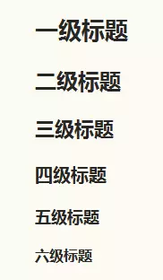
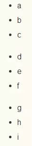
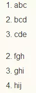
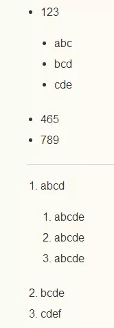
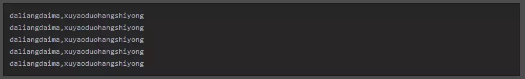
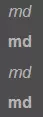
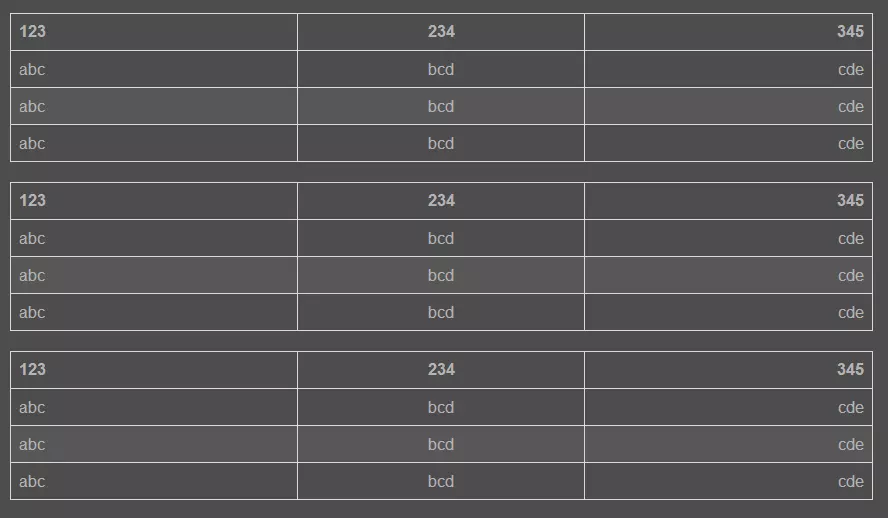

-

## 日常记录

### 用来记录日常开发笔记

## MD语法

### 一、基本符号：* - +. >

基本上所有的markdown标记都是基于这四个符号或组合，需要注意的是，如果以基本符号开头的标记，注意基本符号后有一个用于分割标记符和内容的空格。

### 二、标题

    1.前面带#号，后面带文字，分别表示h1-h6,只到h6，而且h1下面会有一条横线
```
# 一级标题
## 二级标题
### 三级标题
#### 四级标题
##### 五级标题
###### 六级标题
```
2.相当于标签闭合
```
# 一级标题 #
## 二级标题 ##
### 三级标题 ###
#### 四级标题 ####
##### 五级标题 #####
###### 六级标题 #####
```
效果如下图：




### 三、列表

无序列表

```
//形式一
+ a
+ b
+ c
//形式二
- d
- e
- f
//形式三
* g
* h
* i
```
以上三种形式，效果其实都是一样的：



有序列表
```
//正常形式
1. abc
2. bcd
3. cde
//错序效果
2. fgh
3. ghi
5. hij
```
效果图：


> 如图，注意，数字后面的点只能是英文的点，有序列表的序号是根据第一行列表的数字顺序来的，
错序列表的序号本来是序号是乱的， 但是还是显示 2 3 5

嵌套列表

```
//无序列表嵌套
+ 123
    + abc
    + bcd
    + cde
+ 465
+ 789
//有序列表嵌套
1. abcd
    1. abcde
    2. abcde
    3. abcde
2. bcde
3. cdef
```
效果图：



> 列表可以嵌套，使用时在嵌套列表前按 tab 或 空格 来缩进,去控制列表的层数

### 四、引用说明区块

对某个部分做的内容做一些说明或者引用某某的话等，可以用这个语法。

正常形式
```
> 引用内容、说明内容。在语句前面加一个 > ，注意是英文的那个右尖括号，注意空格，引用因为是一个区块，理论上是应该什么内容都可以放，比如说：标题，列表，引用等等。
```
效果图：


嵌套区块

这里我只介绍一下我常用的方法，也是个人认为比较规范的一种方法，就是给区块的下一级区块多加一个右尖括号
```
> 一级引用
>> 二级引用
>>> 三级引用
>>>> 四级引用
>>>>> 五级引用
>>>>>> 六级引用
```
效果图：


### 五、代码块

在发布一些技术文章会涉及展示代码的问题，这时候代码块就显得尤为重要。
少量代码，单行使用，直接用`包裹起来就行了
```
` shaoliangdaima,danhangshiyong `
```
效果图：

大量代码，需要多行使用，用```包裹起来
```
    ```
        daliangdaima,xuyaoduohangshiyong
        daliangdaima,xuyaoduohangshiyong
        daliangdaima,xuyaoduohangshiyong
        daliangdaima,xuyaoduohangshiyong
        daliangdaima,xuyaoduohangshiyong
    ```
```
效果图：


### 六、链接

行内式
链接的文字放在[]中，链接地址放在随后的()中，链接也可以带title属性，链接地址后面空一格，然后用引号引起来

```
[简书](https://www.jianshu.com "创作你的创作"),
是一个创作社区,任何人均可以在其上进行创作。用户在简书上面可以方便的创作自己的作品,互相交流。

```

参数式
链接的文字放在[]中，链接地址放在随后的:后，链接地址后面空一格，然后用引号引起来

```
[简书]: https://www.jianshu.com "创作你的创作"
[简书]是一个创作社区,任何人均可以在其上进行创作。用户在简书上面可以方便的创作自己的作品,互相交流。
//参数定义的其他写法
[简书]: https://www.jianshu.com '创作你的创作'
[简书]: https://www.jianshu.com (创作你的创作)
[简书]: <https://www.jianshu.com> "创作你的创作"
```
以上两种方式其效果图都是一样的，如下：


### 七、图片

行内式
和链接的形式差不多，图片的名字放在[]中，图片地址放在随后的()中，title属性（图片地址后面空一格，然后用引号引起来）,注意的是[]前要加上!

```

```
参数式
图片的文字放在[]中，图片地址放在随后的:后，title属性（图片地址后面空一格，然后用引号引起来）,注意引用图片的时候在[]前要加上!
```
[my-logo.png]: https://upload-images.jianshu.io/upload_images/13623636-6d878e3d3ef63825.png?imageMogr2/auto-orient/strip%7CimageView2/2/w/1240 "my-logo"
![my-logo.png]
//参数定义的其他写法
[my-logo.png]: https://upload-images.jianshu.io/upload_images/13623636-6d878e3d3ef63825.png?imageMogr2/auto-orient/strip%7CimageView2/2/w/1240 'my-logo'
[my-logo.png]: https://upload-images.jianshu.io/upload_images/13623636-6d878e3d3ef63825.png?imageMogr2/auto-orient/strip%7CimageView2/2/w/1240 (my-logo)
[my-logo.png]: <https://upload-images.jianshu.io/upload_images/13623636-6d878e3d3ef63825.png?imageMogr2/auto-orient/strip%7CimageView2/2/w/1240> "my-logo"
```
以上两种方式其效果图都是一样的，如下：


### 八、分割线

分割线可以由* - _（星号，减号，底线）这3个符号的至少3个符号表示，注意至少要3个，且不需要连续，有空格也可以

```
---
- - -
------
***
* * *
******
___
_ _ _
______
```
以上代码的效果图均为：


### 九、其他

强调字体
一个星号或者是一个下划线包起来，会转换为<em>倾斜，如果是2个，会转换为<strong>加粗

```
*md*
**md**
_md_
 __md__

```

 效果图：
 

 转义
基本上和js转义一样,\加需要转义的字符
```
\\
\*
\+
\-
\`
\_
```

删除线
用~~把需要显示删除线的字符包裹起来
```
~~删除~~
```
效果图：


### 十、表格

```md
//例子一
|123|234|345|
|:-|:-:|-:|
|abc|bcd|cde|
|abc|bcd|cde|
|abc|bcd|cde|
//例子二
|123|234|345|
|:---|:---:|---:|
|abc|bcd|cde|
|abc|bcd|cde|
|abc|bcd|cde|
//例子三
123|234|345
:-|:-:|-:
abc|bcd|cde
abc|bcd|cde
abc|bcd|cde
```
> 上面三个例子的效果一样，由此可得：
> 1. 表格的格式不一定要对的非常起，但是为了良好的变成风格，尽量对齐是最好的
> 2. 分割线后面的冒号表示对齐方式，写在左边表示左对齐，右边为右对齐，两边都写表示居中

效果图如下：


## 快捷键

|   功能   |  快捷键  |
| :------: | :------: |
|   加粗   | Ctrl + B |
|   斜体   | Ctrl + I |
|   引用   | Ctrl + Q |
| 插入链接 | Ctrl + L |
| 插入代码 | Ctrl + K |
| 插入图片 | Ctrl + G |
| 提升标题 | Ctrl + H |
| 有序列表 | Ctrl + O |
| 无序列表 | Ctrl + U |
|   横线   | Ctrl + R |
|   撤销   | Ctrl + Z |
|   重做   | Ctrl + Y |

