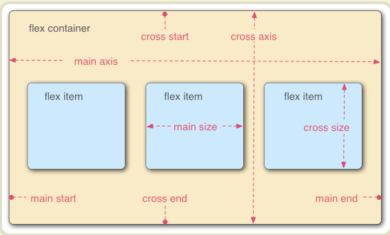

##flex

###基本概念

采用 Flex 布局的元素，称为 Flex 容器（flex container），简称"容器"。
容器默认存在两根轴：水平的主轴（main axis）和垂直的交叉轴（cross axis）

>主轴的开始位置（与边框的交叉点）叫做main start，
>结束位置叫做main end；
>交叉轴的开始位置叫做cross start，
>结束位置叫做cross end。

如图:

###容器的属性 （父盒子的属性，也就是设置了display：flex；）
+ flex-direction: row | row-reverse | column | column-reverse; 属性决定主轴的方向
+ flex-wrap: nowrap | wrap | wrap-reverse; 换行
+ flex-flow: \<flex-direction> || \<flex-wrap>;简写形式 默认row nowrap
+ justify-content: flex-start | flex-end | center | space-between | space-around;主轴上的对齐方式
+ align-items: flex-start | flex-end | center | baseline | stretch;
+ align-content: flex-start | flex-end | center | space-between | space-around | stretch;多根轴线的对齐方式。如果项目只有一根轴线，该属性不起作用。
```css
.box{
  display: -webkit-flex; /* Safari */
  display: flex;
  justify-content: flex-start | flex-end | center | space-between | space-around;
}
```
###项目的属性 （子盒子的属性）
+ order       项目的排列顺序。数值越小，排列越靠前，默认为0。
+ flex-grow   项目的放大比例，默认为0，即如果存在剩余空间，也不放大。
+ flex-shrink 项目的缩小比例，默认为1，即如果空间不足，该项目将缩小。
+ flex-basis  分配多余空间之前，项目占据的主轴空间（main size）
+ flex        是flex-grow, flex-shrink 和 flex-basis的简写，默认值为0 1 auto后两个属性可选。
+ align-self  允许单个项目有与其他项目不一样的对齐方式
```scss
.item {
  flex-shrink: <number>; /* default 1 */
}
.item {
  flex: none | [ <'flex-grow'> <'flex-shrink'>? || <'flex-basis'> ]
}
```


###日常开发问题：
```scss
// 日常开发会遇到用flex后 子盒子设置宽度不生效的情况
.card-item__text{
  line-height: 30px;
  display:flex;
  width:100%;   
  .text-label{
    display: inline-block; 
    width:100px;
    flex-shrink:0;  /* 添加这个就能不受影响 让宽度不会被拉伸 */
    color:#333;
  }
  span{
    white-space: wrap;
    word-wrap: wrap;
    // width:calc(100%-100px);
    flex-grow:1; 
  }
}
```