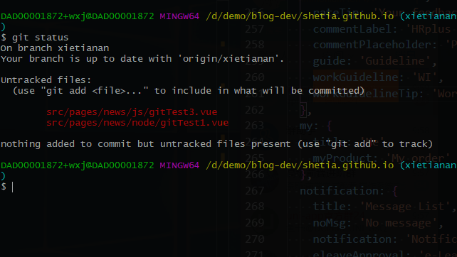
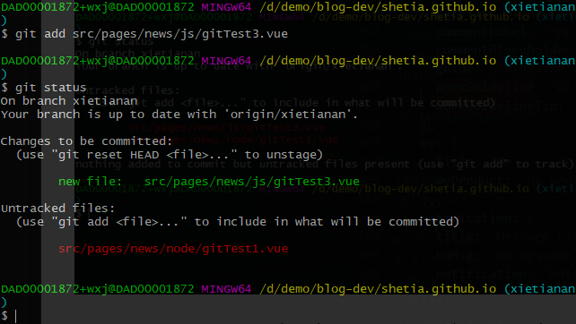
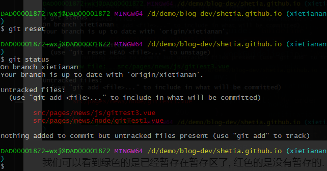
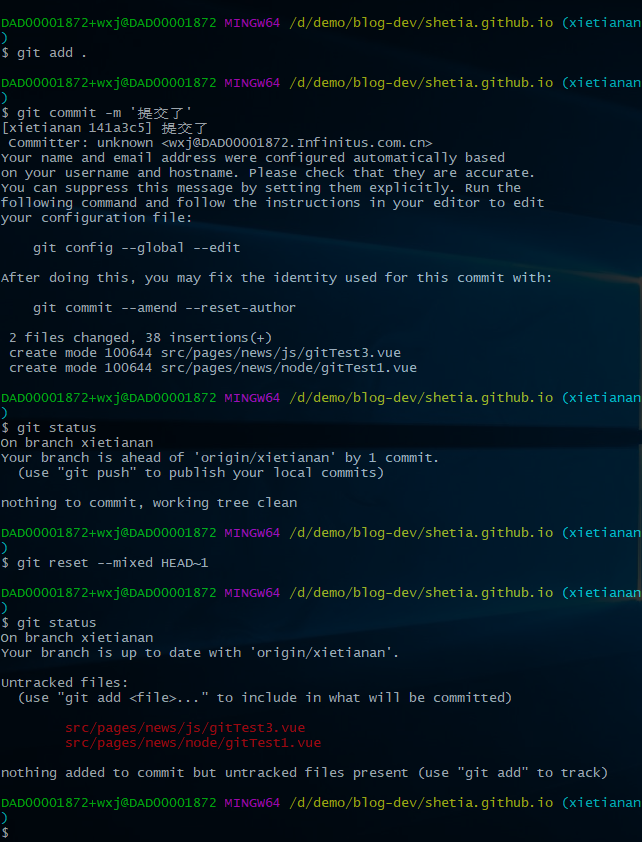

## Git相关操作

#### 部分提交
首先先看下有哪些文件改动了,在项目文件夹打开命令窗口,运行下面命令
```
git status
```
我们可以看到如下图:


现在, 我们可以看到有两个文件改动, 我就以test3 文件为例,先暂存在暂存区:
```
git add src/pages/news/js/gittest3.vue
<!-- 然后在查看一下状态 -->
git status
```
如下图:


我们可以看到绿色的是已经暂存在暂存区了, 红色的是没有暂存的.
之后,如果还是想添加其他文件的可以继续像上面一样添加
然后继续之后的:
```
git commit -m '部分提交test3'

git push
```

这样就完成了部分提交
#### 撤销暂存
 在add之后但还没有commit,如果我们要把存在暂存区的撤销掉的话,可以运行下面的命令
```
  git reset
```


这样就把存在暂存区的撤销了.

#### 撤销commit
如果已经commit了,但还没push, 想要撤销commit
```
git reset --soft HEAD~1 撤回最近一次的commit(撤销commit，不撤销git add)

git reset --mixed HEAD~1 撤回最近一次的commit(撤销commit，撤销git add)

git reset --hard HEAD~1 撤回最近一次的commit(撤销commit，撤销git add,还原改动的代码)
```

