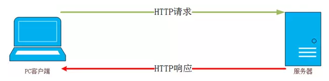
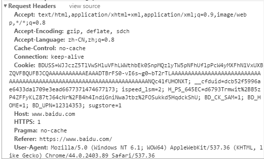

## http 汇总

###什么是 HTTP：

HTTP(HyperText Transfer Protocol 超文本传输协议)是互联网上应用最为广泛的一种网络协议。所有的 WWW 文件都必须遵守这个标准,为了提供一种发布和接收 HTML 页面的方法。HTTP 定义了信息如何被格式化、如何被传输，以及在各种命令下服务器和浏览器所采取的响应。

HTTP 是客户端浏览器或其他程序与 Web 服务器之间的应用层通信协议。在 Internet 上的 Web 服务器上存放的都是超文本信息，客户机需要通过 HTTP 协议传输所要访问的超文本信息。HTTP 包含命令和传输信息，不仅可用于 Web 访问，也可以用于其他因特网/内联网应用系统之间的通信，从而实现各类应用资源超媒体访问的集成。

关于 HTTP 协议的详细内容请参考 RFC2616。

###HTTP 协议的主要特点

**1.支持客户/服务器模式。**
**2.简单快速：** 客户向服务器请求服务时，只需传送请求方法和路径。请求方法常用的有 GET、HEAD、POST。每种方法规定了客户与服务器联系的类型不同。由于 HTTP 协议简单，使得 HTTP 服务器的程序规模小，因而通信速度很快。
**3.灵活：** HTTP 允许传输任意类型的数据对象。正在传输的类型由 Content-Type 加以标记。
**4.无连接：** 无连接的含义是限制每次连接只处理一个请求。服务器处理完客户的请求，并收到客户的应答后，即断开连接。采用这种方式可以节省传输时间。
**5.无状态：** HTTP 协议是无状态协议。无状态是指协议对于事务处理没有记忆能力。缺少状态意味着如果后续处理需要前面的信息，则它必须重传，这样可能导致每次连接传送的数据量增大。另一方面，在服务器不需要先前信息时它的应答就较快。

###技术架构：

HTTP 是一个客户端和服务器端请求和应答的标准（TCP）。客户端是终端用户，服务器端是网站。通过使用 Web 浏览器、网络爬虫或者其它的工具，客户端发起一个到服务器上指定端口（默认端口为 80）的 HTTP 请求。（我们称这个客户端）叫用户代理（user agent）。应答的服务器上存储着（一些）资源，比如 HTML 文件和图像。（我们称）这个应答服务器为源服务器（origin server）。在用户代理和源服务器中间可能存在多个中间层，比如代理，网关，或者隧道（tunnels）。尽管 TCP/IP 协议是互联网上最流行的应用，HTTP 协议并没有规定必须使用它和（基于）它支持的层。 事实上，HTTP 可以在任何其他互联网协议上，或者在其他网络上实现。HTTP 只假定（其下层协议提供）可靠的传输，任何能够提供这种保证的协议都可以被其使用。
　　通常，由 HTTP 客户端发起一个请求，建立一个到服务器指定端口（默认是 80 端口）的 TCP 连接。HTTP 服务器则在那个端口监听客户端发送过来的请求。一旦收到请求，服务器（向客户端）发回一个状态行，比如"HTTP/1.1 200 OK"，和（响应的）消息，消息的消息体可能是请求的文件、错误消息、或者其它一些信息。HTTP 使用 TCP 而不是 UDP 的原因在于（打开）一个网页必须传送很多数据，而 TCP 协议提供传输控制，按顺序组织数据，和错误纠正。
　　通过 HTTP 或者 HTTPS 协议请求的资源由统一资源标示符（Uniform Resource Identifiers）（或者，更准确一些，URLs）来标识。

###工作流程：

既然 HTTP 是基于传输层的 TCP 协议，而 TCP 协议是面向连接的端到端的协议。因此，使用 HTTP 协议传输前，首先建立 TCP 连接，就是因此在谈的 TCP 链接过程的“三次握手”。如图

在 Web 上，HTTP 协议使用 TCP 协议而不是 UDP 协议的原因在于一个网页必须传送很多数据，而且保证其完整性。TCP 协议提供传输控制，按顺序组织数据和错误纠正的一系列功能。

一次 HTTP 操作称为一个事务，其工作过程可分为四步：

1、客户端与服务器需要建立连接。（比如某个超级链接，HTTP 就开始了。）
2、建立连接后，发送请求。
3、服务器接到请求后，响应其响应信息。
4、客户端接收服务器所返回的信息通过浏览器显示在用户的显示屏上，然后客户机与服务器断开连接。

建立连接，其实建立在 TCP 连接基础之上。图解核心工作过程（即省去连接过程）如下：

###关于 HTTP 协议

HTTP 协议采用了请求/响应模型。客户端向服务器发送一个请求，请求头包含请求的方法、URL、协议版本、以及包含请求修饰符、客户信息和内容的类似于 MIME 的消息结构。服务器以一个状态行作为响应，响应的内容包括消息协议的版本，成功或者错误编码加上包含服务器信息、实体元信息以及可能的实体内容。

通常 HTTP 消息包括客户机向服务器的请求消息和服务器向客户机的响应消息。这两种类型的消息由一个起始行，一个或者多个头域，一个指示头域结束的空行和可选的消息体组成。HTTP 的头域包括通用头，请求头，响应头和实体头四个部分。每个头域由一个域名，冒号（:）和域值三部分组成。域名是大小写无关的，域值前可以添加任何数量的空格符，头域可以被扩展为多行，在每行开始处，使用至少一个空格或制表符。

###通用头域：

通用头域包含请求和响应消息都支持的头域，通用头域包含 Cache-Control、Connection、Date、Pragma、Transfer-Encoding、Upgrade、Via。对通用头域的扩展要求通讯双方都支持此扩展，如果存在不支持的通用头域，一般将会作为实体头域处理。下面简单介绍几个在 UPnP 消息中使用的通用头域：

**1.Cache-Control 头域**
　　 Cache-Control 指定请求和响应遵循的缓存机制。

**2.Date 头域**
　　 Date 头域表示消息发送的时间，时间的描述格式由 rfc822 定义。

**3.Pragma 头域**
　　 Pragma 头域用来包含实现特定的指令，最常用的是 Pragma:no-cache。

###请求消息

请求消息的第一行为下面的格式：
　　 MethodSPRequest-URISPHTTP-VersionCRLFMethod 表示对于 Request-URI 完成的方法，这个字段是大小写敏感的，包括 OPTIONS、GET、HEAD、POST、PUT、DELETE、TRACE。

**1.Host 头域**
　　 Host 头域指定请求资源的 Intenet 主机和端口号，必须表示请求 url 的原始服务器或网关的位置。

**2.Referer 头域**
　　 Referer 头域允许客户端指定请求 uri 的源资源地址，这可以允许服务器生成回退链表，可用来登陆、优化 cache 等。

**3.Range 头域**
　　 Range 头域可以请求实体的一个或者多个子范围。

**4.User-Agent 头域**
　　 User-Agent 头域的内容包含发出请求的用户信息。

###响应消息

响应消息的第一行为下面的格式：
　　 HTTP-VersionSPStatus-CodeSPReason-PhraseCRLF
　　 HTTP-Version 表示支持的 HTTP 版本，例如为 HTTP/1.1。Status-Code 是一个三个数字的结果代码。Reason-Phrase 给 Status-Code 提供一个简单的文本描述。
　　 Status-Code 的第一个数字定义响应的类别，后两个数字没有分类的作用。第一个数字可能取 5 个不同的值：

> 1xx:信息响应类，表示接收到请求并且继续处理
> 2xx:处理成功响应类，表示动作被成功接收、理解和接受
> 3xx:重定向响应类，为了完成指定的动作，必须接受进一步处理
> 4xx:客户端错误，客户请求包含语法错误或者是不能正确执行
> 5xx:服务端错误，服务器不能正确执行一个正确的请求

**1.Location 响应头**
　　 Location 响应头用于重定向接收者到一个新 URI 地址。

**2.Server 响应头**
　　 Server 响应头包含处理请求的原始服务器的软件信息。

###实体信息

请求消息和响应消息都可以包含实体信息，实体信息一般由实体头域和实体组成。实体头域包含关于实体的原信息，实体头包括 Allow、Content-Base、Content-Encoding、Content-Language、Content-Length、Content-Location、Content-MD5、Content-Range、Content-Type、Etag、Expires、Last-Modified、extension-header。extension-header 允许客户端定义新的实体头，但是这些域可能无法被接受方识别。

**1.Content-Type 实体头**
　　 Content-Type 实体头用于向接收方指示实体的介质类型，指定 HEAD 方法送到接收方的实体介质类型，或 GET 方法发送的请求介质类型

**2.Content-Range 实体头**

Content-Range 实体头用于指定整个实体中的一部分的插入位置，他也指示了整个实体的长度。

**3.Last-modified 实体头**
　　 Last-modified 实体头指定服务器上保存内容的最后修订时间。

###报文格式：

HTTP 报文由从客户机到服务器的请求和从服务器到客户机的响应构成。请求报文格式如下：

**请求行 － 通用信息头 － 请求头 － 实体头 － 报文主体**

请求行以方法字段开始，后面分别是 URL 字段和 HTTP 协议版本字段，并以 CRLF 结尾。SP 是分隔符。除了在最后的 CRLF 序列中 CF 和 LF 是必需的之外，其他都可以不要。有关通用信息头，请求头和实体头方面的具体内容可以参照相关文件。

如下：

对于其中请求报文详解:
　　 **1、请求行**
　　　　方法字段 + URL + Http 协议版本
　　 **2、通用信息头**
　　　　 Cache-Control 头域：指定请求和响应遵循的缓存机制。
　　　　 keep-alive 是其连接持续有效
　　 **3、请求头**
　　　　 Host 头域
　　　　 Referer 头域：允许客户端指定请求 URL 的资源地址。
　　　　 User-Agent 头域：请求用户信息。【可以看出一些客户端浏览器的内核信息】
　　 4、报文主体

应答报文格式如下：
　　　　**状态行 － 通用信息头 － 响应头 － 实体头 － 报文主体**

状态码元由 3 位数字组成，表示请求是否被理解或被满足。原因分析是对原文的状态码作简短的描述，状态码用来支持自动操作，而原因分析用来供用户使用。客户机无需用来检查或显示语法。有关通用信息头，响应头和实体头方面的具体内容可以参照相关文件。

请求报文相关：

###请求行-请求方法

**GET** 请求获取 Request-URI 所标识的资源
**POST** 在 Request-URI 所标识的资源后附加新的数据
**HEAD** 请求获取由 Request-URI 所标识的资源的响应消息报头
**PUT** 请求服务器存储一个资源，并用 Request-URI 作为其标识
**DELETE** 请求服务器删除 Request-URI 所标识的资源
**TRACE** 请求服务器回送收到的请求信息，主要用于测试或诊断
**CONNECT** 保留将来使用
**OPTIONS** 请求查询服务器的性能，或者查询与资源相关的选项和需求

###响应报文相关：

###响应行-状态码

HTTP 状态码的作用是：**web 服务器用来告诉客户端，发生了什么事。**

状态码位于 HTTP Response 的第一行中，会返回一个”三位数字的状态码“和一个“状态消息”。 ”三位数字的状态码“便于程序进行处理， “状态消息”更便于人理解。

      HTTP状态码被分成了五类:
      100-199 用于指定客户端应相应的某些动作。
      200-299 用于表示请求成功。
      300-399 用于已经移动的文件并且常被包含在定位头信息中指定新的地址信息。
      400-499 用于指出客户端的错误。
      500-599 用于支持服务器错误。

下面提供 HTTP 状态码的完整列表。

###一、临时响应

100-199(临时响应)

表示临时响应并需要请求者继续执行操作的状态码。

| 状态码 | 原因短语 | 含义                                       |
| :----- | :------- | :----------------------------------------- |
| 100    | 继续     | 说明收到了请求的初始部分，请客户端继续发送 |
| 101    | 切换协议 |

###二、成功

200-299 (成功)

表示成功处理了请求的状态码。

| 状态码 | 原因短语   | 含义                                                                                                                                                                                                                                                                                                       |
| :----- | :--------- | :--------------------------------------------------------------------------------------------------------------------------------------------------------------------------------------------------------------------------------------------------------------------------------------------------------- |
| 200    | 成功       | 请求成功                                                                                                                                                                                                                                                                                                   |
| 201    | 已创建     | 用于创建服务器对象的请求（比如 put）响应的实体主体部分中应该包含了各种引用了已创建的资源的 URL。服务器必须在发送这个状态码之前创建好对象                                                                                                                                                                   |
| 202    | 已接受     | 请求已被接收，但服务器还未对其执行任何动作。最终该请求可能会也可能不会被执行。在异步操作的场合下，没有比发送这个状态码更方便的做法了。 返回 202 状态码的响应的目的是允许服务器接受其他过程的请求（例如某个每天只执行一次的基于批处理的操作），而不必让客户端一直保持与服务器的连接直到批处理操作全部完成。 |
| 203    | 非授权信息 | 实体首部包含的信息不是来自于源端服务器，而是来自资源的一份副本。                                                                                                                                                                                                                                           |
| 204    | 无内容     | 响应报文中包含若干首部和一个状态行，但没有实体的主体部分                                                                                                                                                                                                                                                   |
| 205    | 重置内容   | 负责告知浏览器清除当前页面中所有的 HTML 表单元素                                                                                                                                                                                                                                                           |
| 206    | 部分内容   | 服务器成功处理了部分 GET 请求。                                                                                                                                                                                                                                                                            |

###三、重定向

300-399 (重定向)

要完成请求，需要进一步操作。通常，这些状态码用来重定向。Google 建议您在每次请求中使用重定向不要超过 5 次。您可以使用网站管理员工具查看一下 Googlebot 在抓取重定向网页时是否遇到问题。诊断下的网络抓取页列出了由于重定向错误导致 Googlebot 无法抓取的网址。

| 状态码 | 原因短语     | 含义                                                                                                                                                                                   |
| :----- | :----------- | :------------------------------------------------------------------------------------------------------------------------------------------------------------------------------------- |
| 300    | 多种选择     | 客户端请求一个实际指向多个资源的 URL 时会返回这个状态码，比如服务器上有某个 HTML 文档的英语和法语版本。返回这个代码时会带有一个选项列表，这样用户就可以选择他希望使用的那一项。        |
| 301    | 永久移动     | 被请求的资源已永久移动到新位置，在请求的 URL 已被移除时使用。响应的 location 首部中应该包含资源现在所处的 URL                                                                          |
| 302    | 临时移动     | 请求的资源现在临时从不同的 URI 响应请求。                                                                                                                                              |
| 303    | 查看其他位置 | 告知客户端应该用另一个 URL 来获取资源。新的 URL 位于响应报文的 location 首部。其主要目的是允许 post 请求的响应将客户端定向到某个资源上去                                               |
| 304    | 未修改       | 如果客户端发送了一个带条件的 GET 请求且该请求已被允许，而文档的内容（自上次访问以来或者根据请求的条件）并没有改变，则服务器应当返回这个状态码。                                        |
| 305    | 使用代理     | 用来说明必须使用一个代理来访问资源，代理的位置由 location 首部给出。                                                                                                                   |
| 307    | 临时重定向   | 请求的资源现在临时从不同的 URI 响应请求。由于这样的重定向是临时的，客户端应当继续向原有地址发送以后的请求.只有在 Cache-Control 或 Expires 中进行了指定的情况下，这个响应才是可缓存的。 |

###四、请求错误

400-499 (请求错误)

这些状态码表示请求可能出错，妨碍了服务器的处理。

| 状态码 | 原因短语     | 含义                                                                                                                                                                                                                                      |
| :----- | :----------- | :---------------------------------------------------------------------------------------------------------------------------------------------------------------------------------------------------------------------------------------- |
| 400    | 错误请求     | 用于告知客户端它发送了一个错误的请求                                                                                                                                                                                                      |
| 401    | 未授权       | 当前请求需要用户验证。该响应必须包含一个适用于被请求资源的 WWW-Authenticate 信息头用以询问用户信息。客户端可以重复提交一个包含恰当的 Authorization 头信息的请求。如果当前请求已经包含了 Authorization 证书，那么 401 响应代表着服务器验证 | 已经拒绝了那些证书。 |
| 403    | 禁止         | 服务器已经理解请求，但是拒绝执行它。如果服务器想说明拒绝原因，可以在包含实体的主体部分来对原因进行描述。但这个状态码通常在服务器不想说明拒绝原因时使用                                                                                    |
| 404    | 未找到       | 无法找到指定位置的资源。                                                                                                                                                                                                                  |
| 405    | 方法禁用     | 请求方法（GET、POST、HEAD、DELETE、PUT、TRACE 等）对指定的资源不适用。                                                                                                                                                                    |
| 406    | 不接受       | 表示请求资源的 MIME 类型与客户端中 Accept 头信息中指定的类型不一致。                                                                                                                                                                      |
| 407    | 需要代理授权 | 此状态码与 401(未授权)类似，但指定请求者应当授权使用代理。如果服务器返回此响应，还表示请求者应当使用代理。                                                                                                                                |
| 408    | 请求超时     | 请求超时                                                                                                                                                                                                                                  |

###五、服务器错误
500-599(服务器错误)

这些状态码表示服务器在处理请求时发生内部错误。这些错误可能是服务器本身的错误，而不是请求出错。

| 状态码 | 原因短语          | 含义                                                                                                                                                               |
| :----- | :---------------- | :----------------------------------------------------------------------------------------------------------------------------------------------------------------- |
| 500    | 服务器内部错误    | 服务器遇到一个妨碍它为请求提供服务的错误时，使用此状态码。该状态经常由 CGI 程序引起也可能（但愿不会如此！）由无法正常运行的或返回头信息格式不正确的 servlet 引起。 |
| 501    | 尚未实施          | 客户端使用了服务器未实现的请求方法                                                                                                                                 |
| 502    | 错误网关          | 服务器作为网关或者代理时，为了完成请求访问下一个服务器，但该服务器返回了非法的应答。                                                                               |
| 503    | 服务不可用        | 用于说明服务器现在无法为请求提供服务。但将来可以，服务器可提供一个 Retry-After 头信息告诉客户端什么时候资源可用。                                                  |
| 504    | 网关超时          | 该状态也用于充当代理或网关的服务器；它指出接收服务器没有从远端服务器得到及时的响应。                                                                               |
| 505    | HTTP 版本不受支持 | 服务器不支持在请求中所标明 HTTP 版本。                                                                                                                             |
