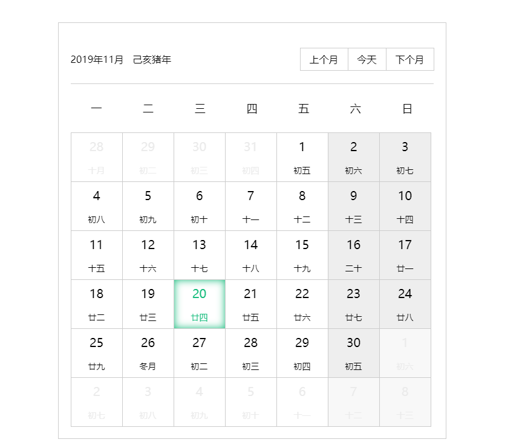

## 日历组件

### 前言

一直很好奇, 类型window系统的日历是怎么写的, 想着js中只有个Date内置函数和日期相关, 没什么思路怎么写, 今天突发奇想, 就百度了一下, 竟然还真有js实现日历, 所以就想手写一番, 以证我js道心.

### 开始

思路主要是: 先弄42个格子, 因为一个月最多也是横跨6周, 所以一个月的日历视图就以42个格子为准, 弄好格子之后, 我们就要放数据了, 这里的数据我们可以分为三部分, 1) 当月的天数 2) 上一月的 3) 下一月的.  最开始我们就以简单的数据开始,农历啥的 之后可以慢慢来,
怎么获取当月的天数呢? 我们可以通过Date这个内置对象来获取.
``` js
// 得到当y年m月份有多少天
getDays (y, m) {
  return new Date(y, m, 0).getDate()
},
```
得到当月有多少天之后, 我们就来看看 上个月留在视图里的天数有多少? 这个又要怎么获取呢?

这个我们可以通过当月1号是星期几来推算. 首先先获取当月1号是星期几
```js
// 得到当前年，这个月的一号是周几
    getWeek () {
      let now = new Date()
      now.setFullYear(this.year)
      now.setMonth(this.month - 1)
      now.setDate(1)
      return now.getDay()
    },
```
通过上面的getWeek知道当月1号是星期几之后,在根据上面的getDays函数得到上个月有多少天, 这样就不难得出 上个月留在视图里的具体日期了,

之后, 下一月留在视图里的数据我们就通过 **42 - 当月天数 - 上月天数** 得到了

```js
   // //将这个月多少天加入数组days
    pushDays () {
      this.days = []
      let year = this.year
      let month = this.month
      let days = this.getDays(year, month)
      let week = this.getWeek(year, month) || 7  // 因为 new Date().getDay() 星期天返回的是0 所以当它是0时 我们用7代替
      for (let i = 1; i <= days; i++) {
        this.days.push(i)
      }
      // 将上个月要显示的天数加入days
      for (let k = 0; k < week - 1; k++) {
        this.days.unshift(k)
      }
      let len = this.days.length
      //将下个月要显示的天数加入days
      for (let j = 1; j <= 42 - len; j++) { 
        this.days.push(j))
      }
    },
```

这样就得出一个长度为42 的 日期数据 数组了, 然后把它在模板里遍历就行了.后面其他一些操作除了农历挺复杂, 就都是些苦力活了.

### 实例

到这里,好像也没什么要说了,直接上完整的代码.

```js
<template>
  <div>
    <!-- {{dataInfo}} -->
    <br>
    <br>
    <div class="calender">
      <div class="top">
        <div class="top_date">{{ year }}年{{ month }}月&nbsp;&nbsp; {{animals()}}年</div>
        <div class="btn_wrap">
          <ul>
            <li @click="perMonth()">上个月</li>
            <li @click="today()">今天</li>
            <li @click="nextMonth()">下个月</li>
          </ul>
        </div>
      </div>

      <div class="date_wrap">
        <ul class="week">
          <li>一</li>
          <li>二</li>
          <li>三</li>
          <li>四</li>
          <li>五</li>
          <li>六</li>
          <li>日</li>
        </ul>
        <ul class="day">
          <li
            v-for="(item, index) in days"
            :key="index"
            :class="{ now: isNow(item.day), isBlur: item.type !== 'same', active: activeIndex === index }"
            @click="handlerClick(item, index)"
          >
            <p >{{ item.day }}</p>
            <span >{{item.lunar[6]==='初一'?item.lunar[5]:item.lunar[6]}}</span>
          </li>
        </ul>
      </div>
    </div>
  </div>
</template>

<script>
import { Lunar } from './Lunar' // 阳历转农历
export default {
  name: 'calender',
  data () {
    return {
      year: new Date().getFullYear(),
      month: new Date().getMonth(),
      days: [],
      dataInfo: '',
      activeIndex: ''
    }
  },
  mounted () {
    this.getDate()
  },
  methods: {
    // 生肖天干地支 年
    animals () {
      let year = this.year
      let month = this.month
      let list = []
      list = year && Lunar.toLunar(year, month, 1)
      return list && (list[3] + list[4])
    },
    // 初始化 当月数据
    getDate () {
      let now = new Date()
      this.year = now.getFullYear()
      this.month = now.getMonth() + 1
      this.pushDays()
    },
    // 得到当前年这个月份有多少天
    getDays (y, m) {
      return new Date(y, m, 0).getDate()
    },
    // 得到当前年，这个月的一号是周几
    getWeek () {
      let now = new Date()
      now.setFullYear(this.year)
      now.setMonth(this.month - 1)
      now.setDate(1)
      return now.getDay()
    },
    // //将这个月多少天加入数组days
    pushDays () {
      this.days = []
      let year = this.year
      let month = this.month
      let days = this.getDays(year, month)
      let week = this.getWeek(year, month) || 7
      for (let i = 1; i <= days; i++) {
        let obj = {
          year: year,
          month: month,
          day: i,
          lunar: Lunar.toLunar(year, month, i),
          isBlur: true,
          type: 'same'
        }
        this.days.push(obj)
      }
      // 将上个月要显示的天数加入days
      var lastMonthDays = this.getDays(year, month - 1)
      let preMonth = month - 1
      let preYear = year
      if (preMonth < 1) { // 当小于1月时 重置为12 年份减1
        preMonth = 12
        preYear = preYear - 1
      }
      for (let k = 0; k < week - 1; k++) {
        let obj = {
          year: preYear,
          month: preMonth,
          day: lastMonthDays - k,
          lunar: Lunar.toLunar(preYear, preMonth, lastMonthDays - k),
          isBlur: false,
          type: 'last'
        }
        this.days.unshift(obj)
      }
      let len = this.days.length
      // //将下个月要显示的天数加入days
      let nextMonth = month + 1
      let nextYear = year
      if (nextMonth > 12) { // 当大于12月时 重置为1 年份加1
        nextMonth = 1
        nextYear = preYear + 1
      }
      for (let j = 1; j <= 42 - len; j++) {
        let obj = {
          year: nextYear,
          month: nextMonth,
          day: j,
          lunar: Lunar.toLunar(nextYear, nextMonth, j),
          isBlur: false,
          type: 'next'
        }
        this.days.push(obj)
      }
      // 返回个promise 为之后点击上月下月提供一个异步操作
      return new Promise((resolve, reject) => {
        resolve()
      })
    },
    // 是否当天
    isNow (days) {
      let now = new Date()
      return (
        now.getFullYear() === this.year &&
        now.getMonth() + 1 === this.month &&
        now.getDate() === days
      )
    },
    // 日期点击事件
    handlerClick (item, index) {
      this.activeIndex = index
      this.dataInfo = item
      // 当点击区域为上个月或下个月的日期时
      if (item.type === 'last') {
        this.perMonth(item)
      } else if (item.type === 'next') {
        this.nextMonth(item)
      }
    },
    // 上个月
    perMonth (item) {
      this.activeIndex = ''
      if (this.month <= 1) {
        this.month = 13
        this.year = this.year - 1
      }
      this.month = this.month - 1
      this.pushDays().then(() => {
        if (item) {
          this.days.forEach((t, i) => {
            if (t.day === item.day && t.month === item.month) {
              this.activeIndex = i
            }
          })
        }
      })
    },
    // 上个月
    nextMonth (item) {
      this.activeIndex = ''
      if (this.month >= 12) {
        this.month = 0
        this.year = this.year + 1
      }
      this.month = this.month + 1
      this.pushDays().then(() => {
        if (item) {
          this.days.forEach((t, i) => {
            if (t.day === item.day && t.month === item.month) {
              this.activeIndex = i
            }
          })
        }
      })
    },
    // 回到今天
    today () {
      this.activeIndex = ''
      this.getDate()
    }
  }
}
</script>

<style lang="scss" scoped>
.calender {
  width: 600px;
  border: 1px solid #ccc;
  padding: 20px;
  margin: 0 auto;
  .top {
    height: 80px;
    border-bottom: 1px solid #ccc;
    display: flex;
    align-items: center;
    justify-content: space-between;
    .btn_wrap {
      ul {
        display: flex;
        li {
          padding: 10px 15px;
          border: 1px solid #ccc;
          margin-right: -1px;
          cursor: pointer;
          &:hover {
            background: #18bd7e !important;
            color: #fff;
          }
        }
      }
    }
  }
  .date_wrap {
    .week {
      display: flex;
      line-height: 80px;
      justify-content: space-around;
      li {
        font-size: 18px;
      }
    }
    .day {
      display: flex;
      flex-wrap: wrap;
      align-items: center;
      li {
        display: flex;
        flex-direction: column;
        align-items: center;
        justify-content: space-around;
        height:80px;
        // line-height: 30px;
        text-align: center;
        flex-shrink: 0;
        width: 14%;
        border: 1px solid #ccc;
        margin-right: -1px;
        margin-bottom: -1px;
        cursor: pointer;
        p{
          font-size:20px;
        }
        span{
          font-size:14px;
        }
        transition: all 0.2s;
        &:nth-of-type(7n - 1),
        &:nth-of-type(7n) {
          background: #eee;
        }
        &.isBlur {
          position:relative;
          color:#ccc;
          &:before{
            position:absolute;
            top:0px;
            bottom:0px;
            left:0px;
            right:0px;
            content:'';
            display:inline-block;
            width:100%;
            height:100%;
            background: rgba(255, 255, 255, 0.6);
          }
        }
        &.now {
          box-shadow: 0px 0px 20px 0px #18bd7e inset;
          color:#18bd7e;
          font-size: 18px;
        }
        &.active {
          background: #18bd7e !important;
          color: #fff;
          box-shadow:none;
        }
        &:hover {
          box-shadow: 0px 0px 20px 0px #ccc inset;
        }
      }
    }
  }
}
</style>


```

农历的我也放上去了, 但我也不太懂,也不敢乱说. 所以直接放代码. 我跟window的对比了一下,发现都还对的上.

```js
/** 用法
 * Lunar.toSolar(2016, 6, 3); 农历转化公历
 * Lunar.toLunar(2016, 7, 6); 公历转化农历
 */
export var Lunar = {
  MIN_YEAR: 1891,
  MAX_YEAR: 2100,
  lunarInfo: [
    [0, 2, 9, 21936], [6, 1, 30, 9656], [0, 2, 17, 9584], [0, 2, 6, 21168], [5, 1, 26, 43344], [0, 2, 13, 59728],
    [0, 2, 2, 27296], [3, 1, 22, 44368], [0, 2, 10, 43856], [8, 1, 30, 19304], [0, 2, 19, 19168], [0, 2, 8, 42352],
    [5, 1, 29, 21096], [0, 2, 16, 53856], [0, 2, 4, 55632], [4, 1, 25, 27304], [0, 2, 13, 22176], [0, 2, 2, 39632],
    [2, 1, 22, 19176], [0, 2, 10, 19168], [6, 1, 30, 42200], [0, 2, 18, 42192], [0, 2, 6, 53840], [5, 1, 26, 54568],
    [0, 2, 14, 46400], [0, 2, 3, 54944], [2, 1, 23, 38608], [0, 2, 11, 38320], [7, 2, 1, 18872], [0, 2, 20, 18800],
    [0, 2, 8, 42160], [5, 1, 28, 45656], [0, 2, 16, 27216], [0, 2, 5, 27968], [4, 1, 24, 44456], [0, 2, 13, 11104],
    [0, 2, 2, 38256], [2, 1, 23, 18808], [0, 2, 10, 18800], [6, 1, 30, 25776], [0, 2, 17, 54432], [0, 2, 6, 59984],
    [5, 1, 26, 27976], [0, 2, 14, 23248], [0, 2, 4, 11104], [3, 1, 24, 37744], [0, 2, 11, 37600], [7, 1, 31, 51560],
    [0, 2, 19, 51536], [0, 2, 8, 54432], [6, 1, 27, 55888], [0, 2, 15, 46416], [0, 2, 5, 22176], [4, 1, 25, 43736],
    [0, 2, 13, 9680], [0, 2, 2, 37584], [2, 1, 22, 51544], [0, 2, 10, 43344], [7, 1, 29, 46248], [0, 2, 17, 27808],
    [0, 2, 6, 46416], [5, 1, 27, 21928], [0, 2, 14, 19872], [0, 2, 3, 42416], [3, 1, 24, 21176], [0, 2, 12, 21168],
    [8, 1, 31, 43344], [0, 2, 18, 59728], [0, 2, 8, 27296], [6, 1, 28, 44368], [0, 2, 15, 43856], [0, 2, 5, 19296],
    [4, 1, 25, 42352], [0, 2, 13, 42352], [0, 2, 2, 21088], [3, 1, 21, 59696], [0, 2, 9, 55632], [7, 1, 30, 23208],
    [0, 2, 17, 22176], [0, 2, 6, 38608], [5, 1, 27, 19176], [0, 2, 15, 19152], [0, 2, 3, 42192], [4, 1, 23, 53864],
    [0, 2, 11, 53840], [8, 1, 31, 54568], [0, 2, 18, 46400], [0, 2, 7, 46752], [6, 1, 28, 38608], [0, 2, 16, 38320],
    [0, 2, 5, 18864], [4, 1, 25, 42168], [0, 2, 13, 42160], [10, 2, 2, 45656], [0, 2, 20, 27216], [0, 2, 9, 27968],
    [6, 1, 29, 44448], [0, 2, 17, 43872], [0, 2, 6, 38256], [5, 1, 27, 18808], [0, 2, 15, 18800], [0, 2, 4, 25776],
    [3, 1, 23, 27216], [0, 2, 10, 59984], [8, 1, 31, 27432], [0, 2, 19, 23232], [0, 2, 7, 43872], [5, 1, 28, 37736],
    [0, 2, 16, 37600], [0, 2, 5, 51552], [4, 1, 24, 54440], [0, 2, 12, 54432], [0, 2, 1, 55888], [2, 1, 22, 23208],
    [0, 2, 9, 22176], [7, 1, 29, 43736], [0, 2, 18, 9680], [0, 2, 7, 37584], [5, 1, 26, 51544], [0, 2, 14, 43344],
    [0, 2, 3, 46240], [4, 1, 23, 46416], [0, 2, 10, 44368], [9, 1, 31, 21928], [0, 2, 19, 19360], [0, 2, 8, 42416],
    [6, 1, 28, 21176], [0, 2, 16, 21168], [0, 2, 5, 43312], [4, 1, 25, 29864], [0, 2, 12, 27296], [0, 2, 1, 44368],
    [2, 1, 22, 19880], [0, 2, 10, 19296], [6, 1, 29, 42352], [0, 2, 17, 42208], [0, 2, 6, 53856], [5, 1, 26, 59696],
    [0, 2, 13, 54576], [0, 2, 3, 23200], [3, 1, 23, 27472], [0, 2, 11, 38608], [11, 1, 31, 19176], [0, 2, 19, 19152],
    [0, 2, 8, 42192], [6, 1, 28, 53848], [0, 2, 15, 53840], [0, 2, 4, 54560], [5, 1, 24, 55968], [0, 2, 12, 46496],
    [0, 2, 1, 22224], [2, 1, 22, 19160], [0, 2, 10, 18864], [7, 1, 30, 42168], [0, 2, 17, 42160], [0, 2, 6, 43600],
    [5, 1, 26, 46376], [0, 2, 14, 27936], [0, 2, 2, 44448], [3, 1, 23, 21936], [0, 2, 11, 37744], [8, 2, 1, 18808],
    [0, 2, 19, 18800], [0, 2, 8, 25776], [6, 1, 28, 27216], [0, 2, 15, 59984], [0, 2, 4, 27424], [4, 1, 24, 43872],
    [0, 2, 12, 43744], [0, 2, 2, 37600], [3, 1, 21, 51568], [0, 2, 9, 51552], [7, 1, 29, 54440], [0, 2, 17, 54432],
    [0, 2, 5, 55888], [5, 1, 26, 23208], [0, 2, 14, 22176], [0, 2, 3, 42704], [4, 1, 23, 21224], [0, 2, 11, 21200],
    [8, 1, 31, 43352], [0, 2, 19, 43344], [0, 2, 7, 46240], [6, 1, 27, 46416], [0, 2, 15, 44368], [0, 2, 5, 21920],
    [4, 1, 24, 42448], [0, 2, 12, 42416], [0, 2, 2, 21168], [3, 1, 22, 43320], [0, 2, 9, 26928], [7, 1, 29, 29336],
    [0, 2, 17, 27296], [0, 2, 6, 44368], [5, 1, 26, 19880], [0, 2, 14, 19296], [0, 2, 3, 42352], [4, 1, 24, 21104],
    [0, 2, 10, 53856], [8, 1, 30, 59696], [0, 2, 18, 54560], [0, 2, 7, 55968], [6, 1, 27, 27472], [0, 2, 15, 22224],
    [0, 2, 5, 19168], [4, 1, 25, 42216], [0, 2, 12, 42192], [0, 2, 1, 53584], [2, 1, 21, 55592], [0, 2, 9, 54560]
  ],
  // 是否闰年
  isLeapYear (year) {
    return ((year % 4 === 0 && year % 100 !== 0) || (year % 400 === 0))
  },
  // 天干地支年
  lunarYear (year) {
    let gan = ['庚', '辛', '壬', '癸', '甲', '乙', '丙', '丁', '戊', '己']
    let zhi = ['申', '酉', '戌', '亥', '子', '丑', '寅', '卯', '辰', '巳', '午', '未']
    let str = year.toString().split('')
    return gan[str[3]] + zhi[year % 12]
  },
  // 生肖年
  zodiacYear (year) {
    var zodiac = ['猴', '鸡', '狗', '猪', '鼠', '牛', '虎', '兔', '龙', '蛇', '马', '羊']
    return zodiac[year % 12]
  },
  // 公历月份天数
  // @param year 阳历-年
  // @param month 阳历-月
  solarMonthDays (year, month) {
    var FebDays = this.isLeapYear(year) ? 29 : 28
    var monthHash = ['', 31, FebDays, 31, 30, 31, 30, 31, 31, 30, 31, 30, 31]
    return monthHash[month]
  },
  // 农历月份天数
  lunarMonthDays (year, month) {
    var monthData = this.lunarMonths(year)
    return monthData[month - 1]
  },
  // 农历月份天数数组
  lunarMonths (year) {
    var yearData = this.lunarInfo[year - this.MIN_YEAR]
    var leapMonth = yearData[0]
    var bit = (+yearData[3]).toString(2)
    var months = []
    for (var i = 0; i < bit.length; i++) {
      months[i] = bit.substr(i, 1)
    }

    for (var k = 0, len = 16 - months.length; k < len; k++) {
      months.unshift('0')
    }

    months = months.slice(0, (leapMonth === 0 ? 12 : 13))
    for (let i = 0; i < months.length; i++) {
      months[i] = +months[i] + 29
    }
    return months
  },
  // 农历每年的天数
  // @param year 农历年份
  lunarYearDays (year) {
    var monthArray = this.lunarYearMonths(year)
    var len = monthArray.length
    return (monthArray[len - 1] === 0 ? monthArray[len - 2] : monthArray[len - 1])
  },
  //
  lunarYearMonths (year) {
    var monthData = this.lunarMonths(year)
    var res = []
    var temp = 0
    var yearData = this.lunarInfo[year - this.MIN_YEAR]
    var len = (yearData[0] === 0 ? 12 : 13)
    for (var i = 0; i < len; i++) {
      temp = 0
      for (let j = 0; j <= i; j++) {
        temp += monthData[j]
      }
      res.push(temp)
    }
    return res
  },
  // 获取闰月
  // @param year 农历年份
  leapMonth (year) {
    var yearData = this.lunarInfo[year - this.MIN_YEAR]
    return yearData[0]
  },
  // 计算农历日期与正月初一相隔的天数
  betweenLunarDays (year, month, day) {
    var yearMonth = this.lunarMonths(year)
    var res = 0
    for (var i = 1; i < month; i++) {
      res += yearMonth[i - 1]
    }
    res += day - 1
    return res
  },
  // 计算2个阳历日期之间的天数
  // @param year 阳历年
  // @param month
  // @param day
  // @param l_month 阴历正月对应的阳历月份
  // @param l_day   阴历初一对应的阳历天
  betweenSolarDays (year, month, day, lMonth, lDay) {
    let time1 = new Date(year + '-' + month + '-' + day).getTime()
    let time2 = new Date(year + '-' + lMonth + '-' + lDay).getTime()
    return Math.floor((time1 - time2) / 24 / 3600 / 1000)
  },
  // 根据距离正月初一的天数计算阴历日期
  // @param year 阳历年
  // @param between 天数
  lunarByBetween (year, between) {
    let lunarArray = []
    let yearMonth = []
    let t = 0
    let e = 0
    let leapMonth = 0
    let m = ''
    if (between === 0) {
      t = 1
      e = 1
      m = '正月'
    } else {
      year = between > 0 ? year : (year - 1)
      yearMonth = this.lunarYearMonths(year)
      leapMonth = this.leapMonth(year)
      between = between > 0 ? between : (this.lunarYearDays(year) + between)
      for (var i = 0; i < 13; i++) {
        if (between === yearMonth[i]) {
          t = i + 2
          e = 1
          break
        } else if (between < yearMonth[i]) {
          t = i + 1
          e = between - ((yearMonth[i - 1]) ? yearMonth[i - 1] : 0) + 1
          break
        }
      }

      m = (leapMonth !== 0 && t === leapMonth + 1)
        ? (this.chineseMonth(t - 1))
        : this.chineseMonth(((leapMonth !== 0 && leapMonth + 1 < t) ? (t - 1) : t))
    }
    lunarArray.push(year, t, e) // 年 月 日
    lunarArray.push(this.lunarYear(year),
      this.zodiacYear(year),
      m,
      this.chineseNumber(e)) // 天干地支年 生肖年 月份 日
    lunarArray.push(leapMonth) // 闰几月
    return lunarArray
  },
  // 中文月份
  chineseMonth (month) {
    var monthHash = ['', '正月', '二月', '三月', '四月', '五月', '六月', '七月', '八月', '九月', '十月', '冬月', '腊月']
    return monthHash[month]
  },
  // 中文日期
  chineseNumber (num) {
    var dateHash = ['', '一', '二', '三', '四', '五', '六', '七', '八', '九', '十']
    let res
    if (num <= 10) {
      res = '初' + dateHash[num]
    } else if (num > 10 && num < 20) {
      res = '十' + dateHash[num - 10]
    } else if (num === 20) {
      res = '二十'
    } else if (num > 20 && num < 30) {
      res = '廿' + dateHash[num - 20]
    } else if (num === 30) {
      res = '三十'
    }
    return res
  },
  // 转换农历
  toLunar: function (year, month, day) {
    var yearData = this.lunarInfo[year - this.MIN_YEAR]
    if (year === this.MIN_YEAR && month <= 2 && day <= 9) {
      return [1891, 1, 1, '辛卯', '兔', '正月', '初一']
    }
    return this.lunarByBetween(year, this.betweenSolarDays(year, month, day, yearData[1], yearData[2]))
  },
  // 转换公历
  // @param year  阴历-年
  // @param month 阴历-月，闰月处理：例如如果当年闰五月，那么第二个五月就传六月，相当于阴历有13个月
  // @param date  阴历-日
  toSolar: function (year, month, day) {
    var yearData = this.lunarInfo[year - this.MIN_YEAR]
    var between = this.betweenLunarDays(year, month, day)
    var ms = new Date(year + '-' + yearData[1] + '-' + yearData[2]).getTime()
    var s = ms + between * 24 * 60 * 60 * 1000
    var d = new Date()
    d.setTime(s)
    year = d.getFullYear()
    month = d.getMonth() + 1
    day = d.getDate()
    return [year, month, day]
  }
}


```

呵呵, 看起来是不是挺刺激的. 有兴趣的可以研究一下, 发现不足的还请不吝赐教, 拜谢大佬!

最后,再上张效果图吧

