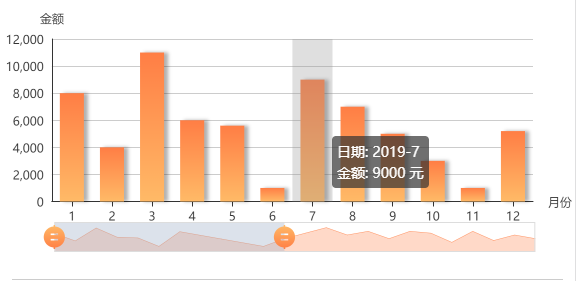

## vue中使用echart

### 前言

 这段时间有个需求需要用到柱状图, 所以去看了下echart的官网, 幸好, 文档很详细, 但是配置项很多, 一开始看的眼花缭乱的, 逐渐的,根据需求就拿了个柱状图, 看着它的配置项一步步的码起来了, 之前自己也使用过echart 但是, 只是跟着社区里的demo, ctrl+c 和 ctrl + d而已, 所以这次记录一下这整个过程吧.

### 起步

安装依赖和引入 
```js
//  安装
npm install echarts --save

// 引入 我是在当前组件引入的,并没有全局引入
import echarts from 'echarts'
```

### 开始

html模板中 只放了一个标签用来放置canvas, 我把这个柱状图弄成一个组件了
```html
<template>
  <div :class="className" :style="{height:height,width:width}" />
</template>
```

然后在js下面写个方法来初始化echart

```js
export default {
  data(){
    return {
      chart:null
    }
  },
  mounted(){
    this.$nextTick(() => {
        this.initChart()
    })
  },
  methods: {
    initChart () {
      this.chart = echarts.init(this.$el)
      this.chart.setOption({
        // 这里写配置,有好多东西可以配,下面是直接拿了它官网教程的一个例子的配置 柱状图
         title: {
          text: 'ECharts 入门示例'
        },
        tooltip: {},
        legend: {
          data:['销量']
        },
        xAxis: {
          data: ["衬衫","羊毛衫","雪纺衫","裤子","高跟鞋","袜子"]
        },
        yAxis: {},
        series: [{
          name: '销量',
          type: 'bar',
          data: [5, 20, 36, 10, 10, 20]
        }]
      })
    }
  }
}
```
到这里我们基本上就会看见一个柱状图出现了,接下来就是配置我们需要的了.

### 配置项

可以查找官网的[配置项](https://www.echartsjs.com/zh/option.html#title), 然后搜索需要的配置进行配置, 他都会有相应的例子供参考

配置过程会修修改改,认识认识这些配置项,发现还是比较有趣的, 下面我直接放我写好的配置项, 会在相应的地方写上注释,这样看会比较清晰些.
```js

initChart () {
      this.chart = echarts.init(this.$el)
      this.chart.setOption({
        tooltip: {  // 提示框组件
          trigger: 'axis', // 触发类型 可选 'item' | 'axis' | 'none'
          axisPointer: { // 坐标轴指示器，坐标轴触发有效
            type: 'shadow' // 默认为直线，可选为：'line' | 'shadow'
          },
          formatter: function (params) {  // 提示条显示的数据格式 params对应下面的series 
            let item = params && params[0].data
            return `日期: ${item.label} <br/> 金额: ${item.value} 元`
          }
        },
        legend: { // 图例组件
          // data: ['工资'],
          // itemGap: 5  // 间隔
        },
        grid: {  // 直角坐标系内绘图网格
          top: '12%',
          left: '1%',
          right: '42px',
          bottom: '15%',
          containLabel: true
        },
        dataZoom: [ // 滑块
          {
            type: 'slider', // 滑动条型数据区域缩放组件
            show: true,
            startValue: this.xAxisData && (this.xAxisData.length - 1) > 6 ? (this.xAxisData.length - 1) - 6 : 0,
            endValue: this.xAxisData && this.xAxisData.length - 1,
            minValueSpan: 5,
            maxValueSpan: 11,
            // zoomLock: true, // 是否锁定选择区域（或叫做数据窗口）的大小
            handleSize: 24, // 滑块尺寸
            handleIcon: 'M10.7,11.9v-1.3H9.3v1.3c-4.9,0.3-8.8,4.4-8.8,9.4c0,5,3.9,9.1,8.8,9.4v1.3h1.3v-1.3c4.9-0.3,8.8-4.4,8.8-9.4C19.5,16.3,15.6,12.2,10.7,11.9z M13.3,24.4H6.7V23h6.6V24.4z M13.3,19.6H6.7v-1.4h6.6V19.6z',  // 滑块的图标
            dataBackground: {
              lineStyle: {
                color: '#ff7e45',
                opacity: '0.8'
              },
              areaStyle: {
                color: '#ff7e45'
              }
            },
            handleStyle: {  // 滑块样式
              color: {
                type: 'linear',
                x: 0,
                y: 0,
                x2: 0,
                y2: 1,
                colorStops: [{
                  offset: 0, color: '#ff7e45' // 0% 处的颜色
                }, {
                  offset: 1, color: '#ffba67' // 100% 处的颜色
                }],
                global: false // 缺省为 false
              }
            }
          },
          {
            type: 'inside', // 内置型数据区域缩放组件
            minValueSpan: 1,
            maxValueSpan: 11,
            zoomLock: true
          }
        ],
        xAxis: [{ // 直角坐标系 grid 中的 x 轴
          name: '月份',
          nameLocation: 'end',
          type: 'category',
          xAxisIndex: this.xAxisData && [(this.xAxisData.length - 1)],
          data: this.xAxisData || [], // 类目数据，在类目轴（type: 'category'）中有效。
          axisTick: { // 是否显示坐标轴刻度。
            alignWithLabel: true  // 刻度线和标签对齐
          }
        }],
        yAxis: [{
          name: '金额',
          type: 'value',
          axisTick: {
            show: false
          }
        }],
        series: [{  // 系列列表。每个系列通过 type 决定自己的图表类型
          color: ['#ff7e45'],
          barCategoryGap: '20px',
          name: '工资',
          type: 'bar',  // 柱状/条形图
          stack: 'vistors',
          barWidth: '60%',        // 柱条宽度可固定 可百分比
          data: this.seriesData || [], // 数据传进来
          animationDuration,
          itemStyle: {
            normal: {
              shadowColor: 'rgba(0, 0, 0, 0.3)',  // 阴影
              shadowBlur: 10,
              shadowOffsetX: '8',
              // barBorderRadius: [10, 10, 0, 0],   // 圆角
              color: new echarts.graphic.LinearGradient(0, 0, 0, 1, [{
                offset: 0,
                color: '#ff7e45'
              },
              {
                offset: 1,
                color: '#ffba67'
              }
              ])
            }
          }
        }]
      })
    }
```

### 整个组件

```js
<template>
  <div :class="className" :style="{height:height,width:width}" />
</template>

<script>
import echarts from 'echarts'
import resize from './mixins/resize'
const animationDuration = 3000
export default {
  mixins: [resize],
  props: {
    className: {
      type: String,
      default: 'chart'
    },
    seriesData: {
      type: Array,
      default: () => {
        return []
      }
    },
    xAxisData: {
      type: Array,
      default: () => {
        return []
      }
    }
  },
  data () {
    return {
      chart: null,
      height: '250px'
    }
  },
  created () {
    this.width = document.body.clientWidth + 'px'
  },
  mounted () {
    this.$nextTick(() => {
      if (this.xAxisData && this.seriesData) {
        this.initChart()
      }
    })
  },
  watch: {
    seriesData: {
      handler (n, o) {
        this.$nextTick(() => {
          if (this.xAxisData && this.seriesData) {
            this.initChart()
          }
        })
      },
      deep: true
    }
  },
  beforeDestroy () {
    if (!this.chart) {
      return
    }
    this.chart.dispose()
    this.chart = null
  },
  methods: {
    initChart () {
      //  为了缩短篇幅 我把这里省去了  跟上面的一样的
    }
  }
}
</script>

```
  > 然后这个resize 文件呢是为了适配屏幕变化的,我也把它贴上来看看, 注意一下路径就行了

```js
// resize.js

// 防抖函数
function debounce (func, wait, immediate) {
  let timeout, args, context, timestamp, result
  const later = function () {
    // 据上一次触发时间间隔
    const last = +new Date() - timestamp
    // 上次被包装函数被调用时间间隔 last 小于设定时间间隔 wait
    if (last < wait && last > 0) {
      timeout = setTimeout(later, wait - last)
    } else {
      timeout = null
      // 如果设定为immediate===true，因为开始边界已经调用过了此处无需调用
      if (!immediate) {
        result = func.apply(context, args)
        if (!timeout) context = args = null
      }
    }
  }
  return function (...args) {
    context = this
    timestamp = +new Date()
    const callNow = immediate && !timeout
    // 如果延时不存在，重新设定延时
    if (!timeout) timeout = setTimeout(later, wait)
    if (callNow) {
      result = func.apply(context, args)
      context = args = null
    }
    return result
  }
}
export default {
  data () {
    return {
      $_sidebarElm: null,
      width: '100%'
    }
  },
  mounted () {
    this.$_initResizeEvent()
    this.$_initSidebarResizeEvent()
  },
  beforeDestroy () {
    this.$_destroyResizeEvent()
    this.$_destroySidebarResizeEvent()
  },
  // to fixed bug when cached by keep-alive
  // https://github.com/PanJiaChen/vue-element-admin/issues/2116
  activated () {
    this.$_initResizeEvent()
    this.$_initSidebarResizeEvent()
  },
  deactivated () {
    this.$_destroyResizeEvent()
    this.$_destroySidebarResizeEvent()
  },
  methods: {
    // use $_ for mixins properties
    // https://vuejs.org/v2/style-guide/index.html#Private-property-names-essential
    $_resizeHandler () {
      return debounce(() => {
        if (this.chart) {
          this.chart.resize()
          this.width = document.body.clientWidth + 'px'
        }
      }, 100)()
    },
    $_initResizeEvent () {
      window.addEventListener('resize', this.$_resizeHandler)
    },
    $_destroyResizeEvent () {
      window.removeEventListener('resize', this.$_resizeHandler)
    },
    $_sidebarResizeHandler (e) {
      if (e.propertyName === 'width') {
        this.$_resizeHandler()
      }
    },
    $_initSidebarResizeEvent () {
      this.$_sidebarElm = document.getElementsByClassName('sidebar-container')[0]
      this.$_sidebarElm && this.$_sidebarElm.addEventListener('transitionend', this.$_sidebarResizeHandler)
    },
    $_destroySidebarResizeEvent () {
      this.$_sidebarElm && this.$_sidebarElm.removeEventListener('transitionend', this.$_sidebarResizeHandler)
    }
  }
}

```

### 组件使用

在要的地方页面引入该组件后使用即可, 传入相应的数据

```xml
  ....省略
     <BarChart :seriesData="seriesData" :xAxisData="xAxisData"></BarChart>
  ....省略
```
数据结构长这样, 可以根据自己的需要修改, 然后修改组件里的formatter 就行了
```js
    // 值数据
    this.seriesData = [
      {
        value: 8000,
        label: '2019-1'
      }
    ]
    // x 轴数据
    this.xAxisData = [
      {
        label: '2019',
        value: 1
      }
    ]

```

最后,我们看下效果


