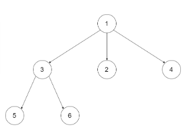

## N叉树的最大深度

### 问题

给定一个 N 叉树，找到其最大深度。

最大深度是指从根节点到最远叶子节点的最长路径上的节点总数。

例如，给定一个 3叉树 :

 

我们应返回其最大深度，3。

说明:

树的深度不会超过 1000。
树的节点总不会超过 5000。

### 解答

```js
/**
 * // Definition for a Node.
 * function Node(val,children) {
 *    this.val = val;
 *    this.children = children;
 * };
 */
/**
 * @param {Node} root
 * @return {number}
 */
var maxDepth = function(root) {
  if(!root) return 0                // 如果没有节点, 直接返回0
  let num = 0                       // 记录深度
  if(root.children){
    root.children.forEach(item=>{   // 遍历有几个节点
      let max = maxDepth(item)      // 递归调用
      num = Math.max(max, num)      // 对比当前和之前得到的 深度, 保留大的
    })
  }
  return num + 1                    // 顶级节点算一个 得加1
};
```